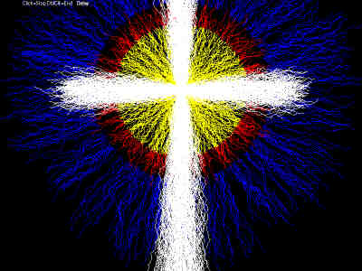

## Lightning Factory

### Description

This code is for generating lightning type graphics via an assortment of parameter editting textboxes. A playlist capability is also included so one may sequence their creations. No help files were made for this but there are plenty of tooltips available hopefully making this pretty much self explanatory. The variety of output available via the parameter textboxes is quite large. A playlist is included to help get a good concept of the function and use of this program. Simply open "__all files.dat" from the menu and click the yellow play button. The other '.dat

files are simply clips of this larger one.

Have fun!
 
### More Info
 

             |
---                |---
**Submitted On**   |2001-12-31 01:11:02
**By**             |[Jose M\. Lopez](https://github.com/Planet-Source-Code/PSCIndex/blob/master/ByAuthor/jose-m-lopez.md)
**Level**          |Intermediate
**User Rating**    |5.0 (10 globes from 2 users)
**Compatibility**  |VB 6\.0
**Category**       |[Graphics](https://github.com/Planet-Source-Code/PSCIndex/blob/master/ByCategory/graphics__1-46.md)
**World**          |[Visual Basic](https://github.com/Planet-Source-Code/PSCIndex/blob/master/ByWorld/visual-basic.md)
**Archive File**   |[Lightning\_45518112002\.zip](https://github.com/Planet-Source-Code/jose-m-lopez-lightning-factory__1-30277/archive/master.zip)

